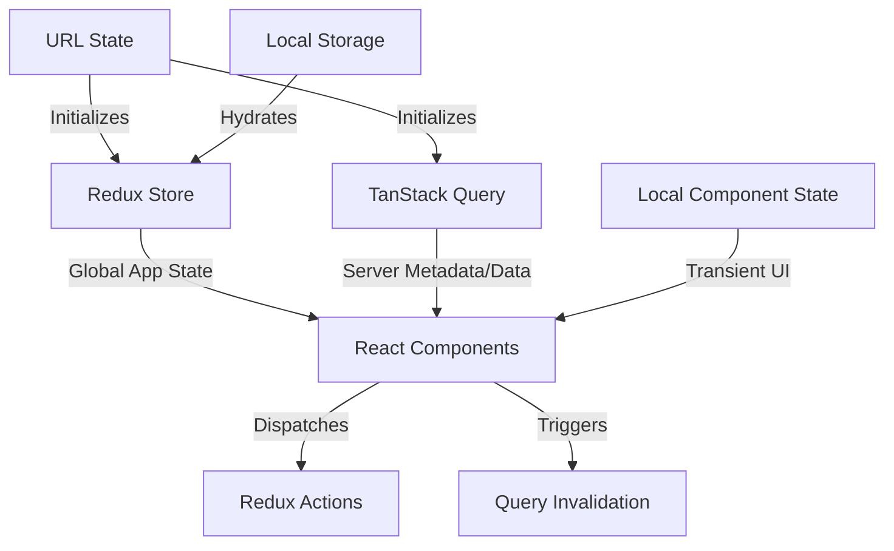

# ADR 0005: Current State Management Architecture

**Status**: Accepted  
**Last Updated**: 2026-01-07  
**Reviewed**: [Date]

---

## TL;DR

Jaeger UI uses a multi-layered state management architecture. **Redux** is the primary legacy store for global application state, while **TanStack Query (React Query)** is the new standard for managing server-side data (Phase 3 OTLP migration). **URL State** is the intended source of truth for the current view (deep linking), though its implementation varies in completeness across different pages. **Local Storage** provides multi-session persistence for user preferences.

---

## Context & Problem

As Jaeger UI migrates to OpenTelemetry (OTEL) concepts and OTLP APIs, the state management architecture is in a transition phase. New developers need to understand where specific types of data reside and how to interact with them to avoid architectural inconsistency.

---

## Architecture Overview

The application state is divided into five distinct layers:

### 1. Redux (Global Application State)
The legacy core of the application. It manages traces, configuration, and search results. The full schema of the store is defined by the [`ReduxState`](../../packages/jaeger-ui/src/types/index.ts#L36) type.

- **Location**: `src/reducers/`, `src/actions/`, and `duck.ts` files in component directories.
- **Access**:
    - **Functional Components**: Use `useSelector` and `useDispatch`.
    - **Class Components**: Wrapped with `connect(mapStateToProps, mapDispatchToProps)`.
- **Legacy Usage**: Currently used for state that must be shared across disparate routes or complex UI interactions (e.g., Trace Comparison, Timeline collapse state). According to [ADR 0004](./0004-state-management-strategy.md), this role will eventually be migrated to **Zustand**.

### 2. TanStack Query (Server State)
The modern standard for fetching and caching server data. Currently being introduced via the OTLP API v3 migration.

- **Location**: `src/hooks/` (e.g., `useOtlpMetadata.ts`), `src/api/v3/client.ts`.
- **Primary Benefits**: Automatic caching, localized loading indicators, and simplified error handling.
- **How it Works (The "Plumbing & Taps" Model)**:
    - **`QueryClientProvider` (The Plumbing)**: Wrapped around the root of the app (`App/index.tsx`), this makes a central client available to all components via React Context.
    - **`QueryClient` (The Central Cache)**: A singleton object that holds all fetched data in memory, indexed by "Query Keys" (e.g., `['services']`).
    - **Hooks (The Taps)**: Components use hooks like `useQuery` to "subscribe" to a specific key. If the data is in the cache, it's returned immediately; if not, it triggers a fetch. When the cache is updated, the hooks automatically trigger a re-render in the subscribing components.
- **Usage**: All new API interactions should use TanStack Query. It replaces the Redux "fetch action -> reducer -> selector" pattern.

### 3. URL State (Intended Source of Truth)
The URL is intended to be the definitive source of truth for the "current view" to enable reliable deep linking and browser navigation. However, the current implementation is inconsistent:

- **Search Page**: Highly synchronized. Most form parameters (service, operation, tags, time range) are reflected in the URL.
- **Trace View**: Partially synchronized. While the trace ID is in the path and `uiFind` is in the query string, many UI settings (e.g., current view type like Gantt vs. Graph, expand/collapse state) are currently stored in Redux or local component state and are lost on page reload.

- **Location**: `src/components/SearchTracePage/url.ts`, `src/utils/url.ts`.
- **Synchronization Pattern**: We use a `key` pattern on major page components (e.g., `<SearchForm key={searchString} />`) to ensure a fresh state mount and synchronization when the URL changes.

### 4. Local Storage (Persistence)
Used to remember user choices across browser sessions.

- **Library**: `store` (legacy).
- **Common Uses**:
    - `lastSearch`: Remembers the last used service and operation.
    - `jaeger-ui/theme`: Current theme preference (light/dark).
    - `jaeger-ui/search-adjust-time-enabled`: Toggle for time adjustment logic.

### 5. Local Component State
For state that doesn't need to live globally or survive a page transition.

- **Hook**: `useState`.
- **Examples**: Form input values, local hover states, or toggleable UI panels that don't affect the URL.

#### Local vs. Global State: At a Glance

| Feature | `useState` (Local State) | `useSelector` (Global/Redux State) |
| :--- | :--- | :--- |
| **Scope** | Private to the component. | Shared across the whole application. |
| **Persistence** | Destroyed when component unmounts. | Persists in the store until app reload. |
| **Source of Truth** | The component itself. | The central Redux Store. |
| **Use Cases** | Form inputs, local toggles, UI hover states. | User profile, App config, Trace data. |

---

## Developer Roadmap: Where do I put my state?

1. **Is it data from the server?**
    - Use **TanStack Query**. Create a hook in `src/hooks/` and a client method in `src/api/v3/`.
2. **Is it a user preference that should survive a refresh?**
    - Use **Local Storage** via the `store` utility.
3. **Does it need to be deep-linkable?**
    - Sync it with the **URL**.
4. **Is it complex state shared between many unrelated components?**
    - Use **Redux** (or **Zustand** if following the strategic direction in ADR 0004).
5. **Is it a global configuration setting?**
    - Use a **dedicated configuration hook** (e.g., `useConfig()`). Avoid direct access to global helper functions, prop drilling, or raw Redux selectors within components. This allows the underlying storage to change (e.g., from Redux to Zustand) without breaking components.
6. **Is it just for this component?**
    - Use `useState`.

---

## Configuration Management

Jaeger UI is configured via a global object injected by the backend (accessible via `window.getJaegerUiConfig()`).

### The Idiomatic Way: The `useConfig()` Hook
Infrastructure-related settings (like `useOpenTelemetryTerms`) should be accessed via a dedicated React hook rather than prop drilling or direct Redux selectors.

- **Recommended**: `const { useOpenTelemetryTerms } = useConfig();`
- **Avoid**: `const useOtelTerms = useSelector(state => state.config.useOpenTelemetryTerms);`

**Why use a dedicated hook instead of Redux selectors?**
1. **Decoupling**: It hides the implementation detail of *where* the config is stored. Per [ADR 0004](./0004-state-management-strategy.md), we are moving away from Redux toward Zustand. A common hook allows this transition to happen seamlessly.
2. **Testability**: You can easily mock the hook in unit tests without setting up a full Redux provider.
3. **Ergonomics**: It provides a cleaner, typed API for commonly used settings.

---

## Verification Plan

### Automated Tests
- Redux: `src/reducers/*.test.js`, `src/actions/*.test.js`.
- Hooks: `src/hooks/*.test.ts` (using `@testing-library/react-hooks`).

### Manual Verification
- Verify that state resets correctly when navigating via browser history.
- Ensure loading states are localized and don't block the entire UI.
- Check that `lastSearch` values are correctly hydrated from local storage on first load.
