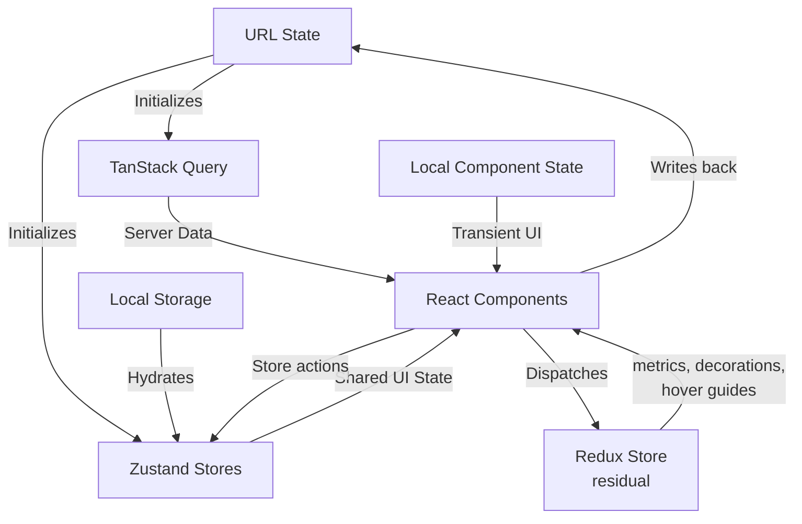

# ADR-0005: Current State Management Architecture

* **Status**: Documented existing implementation — snapshot as of 2026-07-28; to be superseded once Redux is gone ([RFC 0004](../rfc/0004-state-management-strategy.md) Phase 4c)
* **Date**: 2026-01-07

---

## TL;DR

Jaeger UI uses a multi-layered state management architecture. **TanStack Query (React Query)** owns server data, **Zustand** owns shared client UI state, **URL State** is the intended source of truth for the current view (deep linking, though completeness varies by page), and **Local Storage** provides multi-session persistence for user preferences.

**Redux is nearly gone.** It no longer holds traces, search results, services, config, dependencies, or the DDG graph. What remains is two reducers (`metrics`, `pathAgnosticDecorations`), the `traceTimeline` duck that survives only because analytics tracking is implemented as a Redux middleware, and a few `connect()` wrappers that no longer read state at all. **Do not add state to Redux** — see the roadmap below. [RFC 0006](../rfc/0006-target-state-management-architecture.md) describes the target; [RFC 0004](../rfc/0004-state-management-strategy.md) tracks what is left.

---

## Context & Problem

As Jaeger UI migrates to OpenTelemetry (OTEL) concepts and OTLP APIs, and off Redux per [ADR-0004](./0004-state-management-strategy.md), the state management architecture is in a transition phase. New developers need to understand where specific types of data reside and how to interact with them to avoid architectural inconsistency.

This ADR is a point-in-time snapshot of that transition, not a document maintained as the migration proceeds. Where it disagrees with the code, the code is right; the phase checklist in [RFC 0004](../rfc/0004-state-management-strategy.md) is the better guide to what has moved since.

---

## Architecture Overview

The application state is divided into these layers:

```mermaid
graph TD
    A[URL State] -->|Initializes| C[TanStack Query]
    A -->|Initializes| Z[Zustand Stores]
    D[Local Storage] -->|Hydrates| Z
    C -->|Server Data| E[React Components]
    Z -->|Shared UI State| E
    F[Local Component State] -->|Transient UI| E
    B[Redux Store<br/>residual] -->|metrics, decorations,<br/>hover guides| E
    E -->|Writes back| A
    E -->|Store actions| Z
    E -->|Dispatches| B
```

The Redux box is scheduled for deletion; the timeline slice inside it is written in parallel with the corresponding Zustand store rather than being read by the UI.

### 1. Redux (residual, closed to new state)
The legacy core of the application, now reduced to a residue. The full schema of the store is defined by the [`ReduxState`](../../packages/jaeger-ui/src/types/index.ts) type.

- **Location**: `src/reducers/` (`metrics`, `pathAgnosticDecorations`), `src/actions/path-agnostic-decorations.ts`, and `src/components/TracePage/TraceTimelineViewer/duck.ts`; assembled in `src/utils/configure-store.ts`. There is no `src/selectors/`.
- **Access**:
    - **Functional Components**: `useSelector` / `useDispatch` — `DdgNodeContent`, `SpanDetailSidePanel`.
    - **Class Components**: `connect(mapStateToProps, mapDispatchToProps)` — `Monitor/ServicesView`, `DeepDependencies/SidePanel/DetailsPanel`, `TracePage`, `TraceTimelineViewer`. `SearchForm` and `TraceDiff` are also still wrapped, but their `mapStateToProps` ignores state entirely and the wrapper is vestigial.
- **Timeline dual write**: timeline interactions dispatch a Redux action *and* call the equivalent Zustand action, Redux first so the tracking middleware observes pre-update state. The duck exists to feed `src/middlewares/track.ts`, not to serve the UI.
- **Do not add new state here.** Per [ADR-0004](./0004-state-management-strategy.md), everything above has a scheduled removal; new shared UI state goes to Zustand and new server data to TanStack Query.

### 1a. Zustand (shared client UI state)
The replacement for Redux's role. Cross-feature stores live in `src/stores/`; a store read by only one feature lives in a `store.<slice>.ts` beside it.

| Store | File | Owns |
| :--- | :--- | :--- |
| `useTraceTimelineStore` | `components/TracePage/TraceTimelineViewer/store.timeline.ts` | Per-trace timeline interaction (collapse, open details, pruned services) |
| `useLayoutPrefsStore` | `components/TracePage/TraceTimelineViewer/store.layout.ts` | Timeline layout preferences, persisted to `localStorage` |
| `useTraceDiffStore` | `stores/trace-diff-store.ts` | Compare cohort |
| `useArchiveStore` | `stores/archive-store.ts` | Archive mutation status |
| `useEmbeddedStore` | `stores/embedded-store.ts` | Embedded-mode chrome flags |
| `useSearchResultsStore` | `components/SearchTracePage/store.search-results.ts` | Search results view state |
| `useDdgViewModifiersStore` | `components/DeepDependencies/store.view-modifiers.ts` | DDG view modifier flags |

Selectors must be fine-grained: a virtualized row subscribes only to the span IDs it cares about, so an unrelated store change does not re-render it. Class components receive store state through `createStoreConnector` in `utils/zustand-class-bridge.tsx`.

### 2. TanStack Query (Server State)
The modern standard for fetching and caching server data. Currently being introduced via the OTLP API v3 migration.

- **Location**: `src/hooks/` (e.g., `useTraceDiscovery.ts`), `src/api/v3/client.ts` (`JaegerClient`).
- **Primary Benefits**: Automatic caching, localized loading indicators, and simplified error handling.
- **How it Works (The "Plumbing & Taps" Model)**:
    - **`QueryClientProvider` (The Plumbing)**: Wrapped around the root of the app (`App/index.tsx`), this makes a central client available to all components via React Context.
    - **`QueryClient` (The Central Cache)**: A singleton object that holds all fetched data in memory, indexed by "Query Keys" (e.g., `['services']`).
    - **Hooks (The Taps)**: Components use hooks like `useQuery` to "subscribe" to a specific key. If the data is in the cache, it's returned immediately; if not, it triggers a fetch via the `jaegerClient`. When the cache is updated, the hooks automatically trigger a re-render in the subscribing components.
- **Usage**: All new API interactions should use TanStack Query. It replaces the Redux "fetch action -> reducer -> selector" pattern.

### 3. URL State (Intended Source of Truth)
The URL is intended to be the definitive source of truth for the "current view" to enable reliable deep linking and browser navigation. However, the current implementation is inconsistent:

- **Search Page**: Highly synchronized. Most form parameters (service, operation, tags, time range) are reflected in the URL.
- **Trace View**: Partially synchronized. The trace ID is in the path and `uiFind` in the query string, but the selected view type (Gantt vs. Graph vs. Statistics) is `useState` in `TracePage`, expand/collapse state lives in the timeline Zustand store, and column widths / detail-panel mode live in `localStorage` — none of it round-trips through a shared link. [RFC 0007](../rfc/0007-layout-settings-priority-stack.md) proposes precedence rules for closing this gap.

- **Location**: `src/components/SearchTracePage/url.ts`, `src/utils/url.ts`.
- **Synchronization Pattern**: We use a `key` pattern on major page components (e.g., `<SearchForm key={searchString} />`) to ensure a fresh state mount and synchronization when the URL changes.

### 4. Local Storage (Persistence)
Used to remember user choices across browser sessions.

- **Library**: `store` (legacy).
- **Common Uses**:
    - `lastSearch`: Remembers the last used service and operation.
    - `jaeger-ui/theme`: Current theme preference (light/dark).
    - `jaeger-ui/search-adjust-time-enabled`: Toggle for time adjustment logic.

### 5. Local Component State
For state that doesn't need to live globally or survive a page transition.

- **Hook**: `useState`.
- **Examples**: Form input values, local hover states, or toggleable UI panels that don't affect the URL.

#### Local vs. Global State: At a Glance

| Feature | `useState` (Local State) | Zustand selector (Global State) |
| :--- | :--- | :--- |
| **Scope** | Private to the component. | Shared across the whole application. |
| **Persistence** | Destroyed when component unmounts. | Persists in the store until app reload. |
| **Source of Truth** | The component itself. | The store. |
| **Use Cases** | Form inputs, local toggles, UI hover states. | Compare cohort, timeline interaction, embedded flags. |

---

## Developer Roadmap: Where do I put my state?

1. **Is it data from the server?**
    - Use **TanStack Query**. Create a hook in `src/hooks/` and a client method in `src/api/v3/`.
2. **Is it a user preference that should survive a refresh?**
    - Use **Local Storage** via the `store` utility.
3. **Does it need to be deep-linkable?**
    - Sync it with the **URL**.
4. **Is it complex state shared between many unrelated components?**
    - Use **Zustand** — a store in `src/stores/`, or colocated with the feature that owns it. Never Redux.
5. **Is it a global configuration setting?**
    - Use a **dedicated configuration hook** (e.g., `useConfig()`). Avoid direct access to global helper functions, prop drilling, or raw Redux selectors within components. This allows the underlying storage to change (e.g., from Redux to Zustand) without breaking components.
6. **Is it just for this component?**
    - Use `useState`.

---

## Configuration Management

Jaeger UI is configured via a global object injected by the backend (accessible via `window.getJaegerUiConfig()`).

### The Idiomatic Way: The `useConfig()` Hook
Infrastructure-related settings (like `useOpenTelemetryTerms`) should be accessed via a dedicated React hook rather than prop drilling or direct Redux selectors.

- **Recommended**: `const { useOpenTelemetryTerms } = useConfig();`
- **Avoid**: `const useOtelTerms = useSelector(state => state.config.useOpenTelemetryTerms);`

**Why use a dedicated hook instead of Redux selectors?**
1. **Decoupling**: It hides the implementation detail of *where* the config is stored. Per [ADR-0004](./0004-state-management-strategy.md), we are moving away from Redux toward Zustand. A common hook allows this transition to happen seamlessly.
2. **Testability**: You can easily mock the hook in unit tests without setting up a full Redux provider.
3. **Ergonomics**: It provides a cleaner, typed API for commonly used settings.

---

## References

- [ADR-0004: State Management Strategy](./0004-state-management-strategy.md) - the decision to move to Zustand + TanStack Query
- [RFC 0004: State Management Strategy](../rfc/0004-state-management-strategy.md) - the phased migration checklist and what remains
- [RFC 0006: Target State Management Architecture](../rfc/0006-target-state-management-architecture.md) - where each kind of state should live when the migration completes
