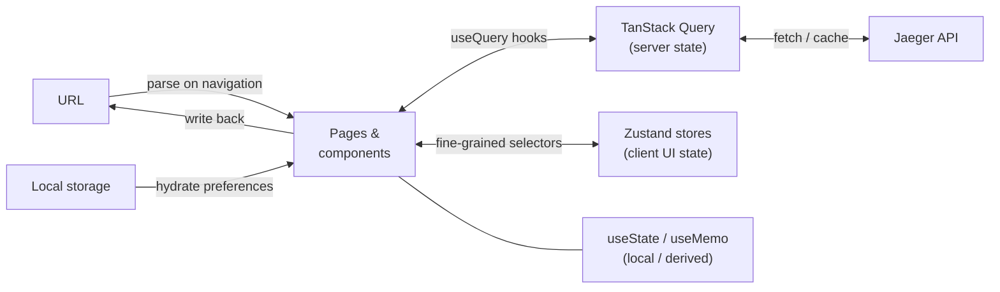
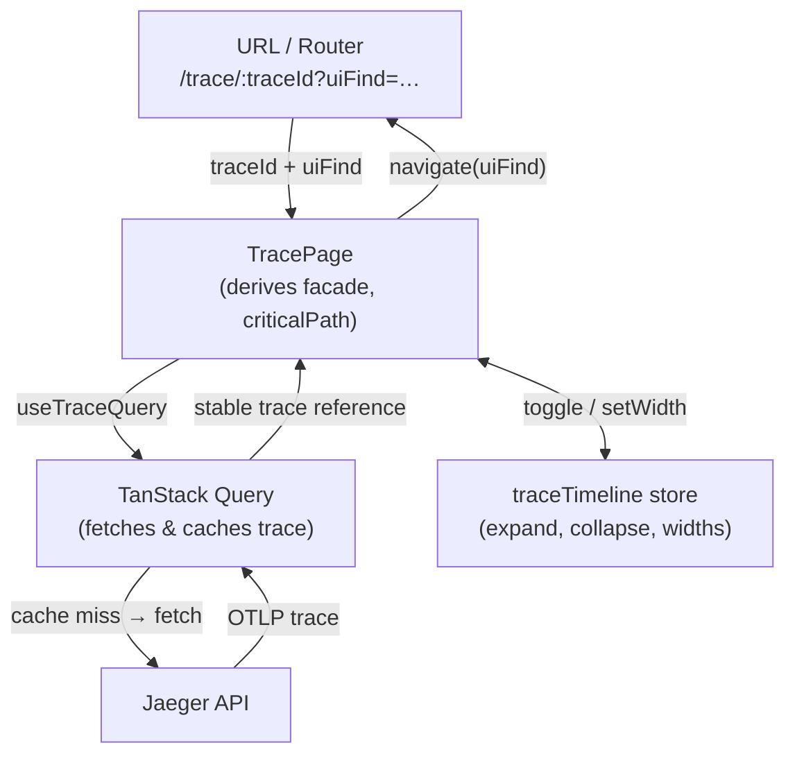

# ADR 0008: Target state management architecture

**Status**: In progress (evolves with the codebase)  
**Last Updated**: 2026-04-07

---

## Relationship to other ADRs

| Document | Role |
| :--- | :--- |
| **[ADR 0004](./0004-state-management-strategy.md)** | **Decision and migration**: why we chose Zustand + TanStack Query, alternatives considered, and the **phased migration checklist** (Phase 0–4) with rollback and testing notes. |
| **[ADR 0005](./0005-current-state-management-architecture.md)** | **Transition snapshot**: how Redux, Query, URL, and local state interact **today** while migration is incomplete. |
| **This ADR (0008)** | **Target architecture**: where each kind of state **should** live when migration is complete, and how data flows between layers. Update this document as the codebase catches up so it stays the canonical "how we do things" reference. |

If this ADR conflicts with **0004** on strategic direction, **0004 wins** until it is superseded. Execution order and checkmarks belong in **0004 → Migration Path**, not here.

---

## TL;DR

| Layer | Owns | Does NOT own | Key files |
| :--- | :--- | :--- | :--- |
| **TanStack Query** | Server responses: traces, search results, services, metrics, DDG graph payloads, dependencies | Interaction state; layout settings | `src/query/app-query-client.tsx`, `src/hooks/`, `src/api/v3/` |
| **Zustand** | Shared client UI state: span collapse/expand, open detail panels, column widths, compare cohort, DDG view modifiers, embedded flags | Primary trace JSON; URL-derived navigation params | `src/stores/` (target location) |
| **URL** | Current view: trace id, search params, `uiFind`, compare params; anything that should survive a copy-paste link | Large objects; transient hover / focus state | `src/utils/url.ts`, per-page `url.ts` modules |
| **Local storage** | User preferences that survive sessions: theme, last search service/operation, column widths, detail-panel mode | Server data; application state | `store` utility, direct `localStorage` for per-preference keys |
| **`useState` / `useMemo`** | Transient leaf UI (hover, draft inputs) and heavy derivations (critical path, stats) keyed to a trace reference | Global sharing; URL persistence | Colocated in component files |

**Redux is absent** in the target. During migration, see **[ADR 0005](./0005-current-state-management-architecture.md)** for the current hybrid wiring.

---

## Architecture overview

The diagram below shows the **target** data flow by actual page/component. Until migration completes, Redux sits between many of these boxes - see **0005** for the current picture.



### Trace page: data movement in detail

How `TracePage` works once server state lives fully in Query and timeline UI in Zustand:



---

## URL state: mapping pattern

Every navigable page follows a consistent two-file pattern for reading and writing URL state.

### Pattern

```
src/components/<Page>/
└── url.ts          ← getUrl(state) + getUrlState(search) helpers
```

`getUrlState(search: string)` parses the query string into a typed object. `getUrl(state)` serialises it back. Components never build URLs by hand.

### Read: URL → component state

```tsx
// Inside SearchTracePage
const { search } = useLocation();                // raw query string
const urlState = getUrlState(search);            // typed { service, operation, tags, … }

// Passing `search` as the React key forces a full remount (and re-read)
// when the URL changes, so the form always reflects the URL.
<SearchForm key={search} defaultValue={urlState} />
```

### Write: user action → URL

```tsx
// User picks a service in the form
function onServiceChange(service: string) {
  const next = getUrl({ ...urlState, service });
  navigate(next);                                // URL becomes source of truth
}
```

### What gets encoded per page

| Page | URL params | Notes |
| :--- | :--- | :--- |
| **Search** | `service`, `operation`, `tags`, `start`, `end`, `limit`, `lookback`, `traceID[]`, `span[]` | Fully round-trips; `span[]` encodes `spanId@traceId` for linked spans |
| **Trace view** | `traceId` (route segment), `uiFind` (query) | Column widths, expand state **not** in URL (local storage / Zustand) |
| **Trace diff** | `cohort[]`, `a`, `b` (query params) | Parsed from URL into `traceDiff` store on mount |
| **Deep Dependencies** | `service`, `operation`, `start`, `end`, `visEncoding`, `showOperations` | All view modifiers in URL; DDG store holds same shape during session |
| **Monitor** | `service` | Minimal; page fetches metrics from Query on mount |

### Class components

Legacy class components receive URL-derived props via the project's `withRouteProps` HOC (`src/utils/withRouteProps.tsx`), which wraps React Router v7's `useLocation`, `useParams`, and `useNavigate` hooks and injects them as props (`location`, `search`, `params`, `navigate`). The same HOC pattern applies for Zustand: `createStoreConnector` in `utils/zustand-class-bridge.tsx` wraps a class component to inject store state as props.

---

## Zustand stores: target state shapes

The tables below document the **intended** store shapes. For migration steps — which Redux ducks these replace and which components need rewiring — see **[ADR 0004 → Phase 1](./0004-state-management-strategy.md#phase-1--zustand-for-client-ui-state)**.

### `useTraceTimelineStore`

| Field | Type | Description | Persisted to |
| :--- | :--- | :--- | :--- |
| `traceID` | `string \| null` | Currently loaded trace; reset resets interaction state | - |
| `childrenHiddenIDs` | `Set<string>` | Span IDs whose children are collapsed | - |
| `detailStates` | `Map<string, DetailState>` | Open detail panels per span ID | - |
| `hoverIndentGuideIds` | `Set<string>` | Span IDs with active indent-guide hover highlight | - |
| `spanNameColumnWidth` | `number` | Fraction of timeline width for the name column (0.15–0.85) | `localStorage['spanNameColumnWidth']` |
| `sidePanelWidth` | `number` | Fraction for side-panel column (0.2–0.7) | `localStorage['sidePanelWidth']` |
| `detailPanelMode` | `'inline' \| 'sidepanel'` | Whether span details appear inline or in a side panel | `localStorage['detailPanelMode']` |
| `timelineBarsVisible` | `boolean` | Whether the Gantt bars column is shown | `localStorage['timelineVisible']` |
| `shouldScrollToFirstUiFindMatch` | `boolean` | One-shot flag; set after `uiFind` focus, cleared by the list | - |

**Key behaviour**: when `traceID` changes, all ephemeral fields (`childrenHiddenIDs`, `detailStates`, `hoverIndentGuideIds`, `shouldScrollToFirstUiFindMatch`) reset; persistent layout fields (`spanNameColumnWidth`, `sidePanelWidth`, `detailPanelMode`, `timelineBarsVisible`) carry over across traces.

### `useTraceDiffStore`

| Field | Type | Description |
| :--- | :--- | :--- |
| `cohort` | `string[]` | Ordered list of trace IDs selected for comparison |
| `a` | `string \| null` | Trace ID pinned to the left (A) pane |
| `b` | `string \| null` | Trace ID pinned to the right (B) pane |

Actions: `addToCohort(traceId)`, `removeFromCohort(traceId)`, `setA(traceId)`, `setB(traceId)`. Removing a trace from the cohort also clears `a` or `b` if they match.

### `useDdgModifiersStore`

Holds **view modifier flags** only. The DDG graph JSON (nodes + edges) lives in TanStack Query (`useDDGQuery`).

| Field | Type | Description |
| :--- | :--- | :--- |
| `showOperations` | `boolean` | Toggle operation-level nodes |
| `visEncoding` | `string \| null` | Visual encoding preset key |
| `density` | `'summary' \| 'full'` | Node density |

### `useEmbeddedStore`

| Field | Type | Description |
| :--- | :--- | :--- |
| `isEmbedded` | `boolean` | Hide full-app chrome when running inside an iframe |
| `disableLogFinder` | `boolean` | Suppress log search UI |
| *(other chrome flags)* | `boolean` | Derived from query param `embed` on app boot |

---

## Where do I put new state? (target)

1. **Fetched from the server or cached by HTTP semantics?** → **TanStack Query** - create a hook in `src/hooks/` and a client method in `src/api/v3/`.
2. **Shared UI that is not URL-derived and not server data?** → **Zustand** - add to an existing store (prefer) or create a focused new one in `src/stores/`.
3. **Should survive refresh and live in the URL?** → **URL** - use the page's `url.ts` `getUrl` / `getUrlState` helpers; never construct URLs inline.
4. **Must survive a session across browser tabs?** → **Local storage** - use the existing `store` utility or `localStorage` for simple string keys.
5. **Only this component needs it, or it is a pure function of a trace reference?** → **`useState` / `useMemo`** - keep it colocated; avoid globalising heavy derivations.
6. **App configuration or feature flags?** → Keep a stable hook surface (e.g. **`useConfig()`**); implementation may be a Zustand slice or module constant - do **not** spread raw Redux selectors or global singletons in components.

---

## Principles (from ADR 0004)

1. **Standardize on Zustand + TanStack Query** for new and migrated code.
2. **Prefer colocated heavy derivations** (`useMemo`, pure module helpers) over global stores for trace-sized computations.
3. **Selective subscriptions**: Zustand selectors must be fine-grained so virtualized rows do not re-render on unrelated store changes.

---

## Rollback and verification

Rollback strategy and phase-level testing are defined next to the migration checklist in **[ADR 0004 — Migration Path](./0004-state-management-strategy.md#migration-path)**. This ADR does not duplicate them.

---

## References

- **[ADR 0004: State management strategy](./0004-state-management-strategy.md)** - decision, comparison, and migration checklist.
- **[ADR 0002: OTLP / API v3](./0002-otlp-api-v3-migration.md)** - server API direction; Query hooks align with `api/v3`.
- **[ADR 0005: Current state management architecture](./0005-current-state-management-architecture.md)** - current wiring, valid during migration.
- [Zustand](https://github.com/pmndrs/zustand)
- [TanStack Query](https://tanstack.com/query/latest)
- [TanStack Virtual](https://tanstack.com/virtual/latest)
